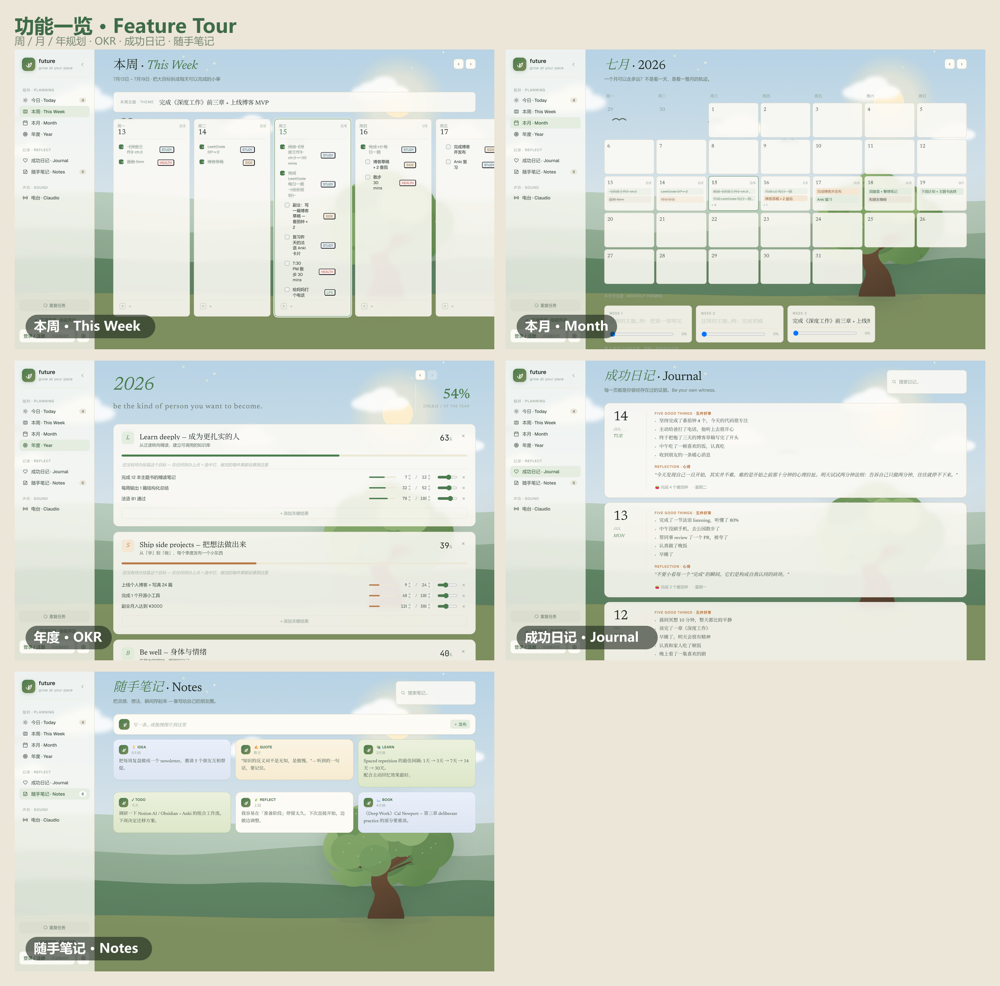
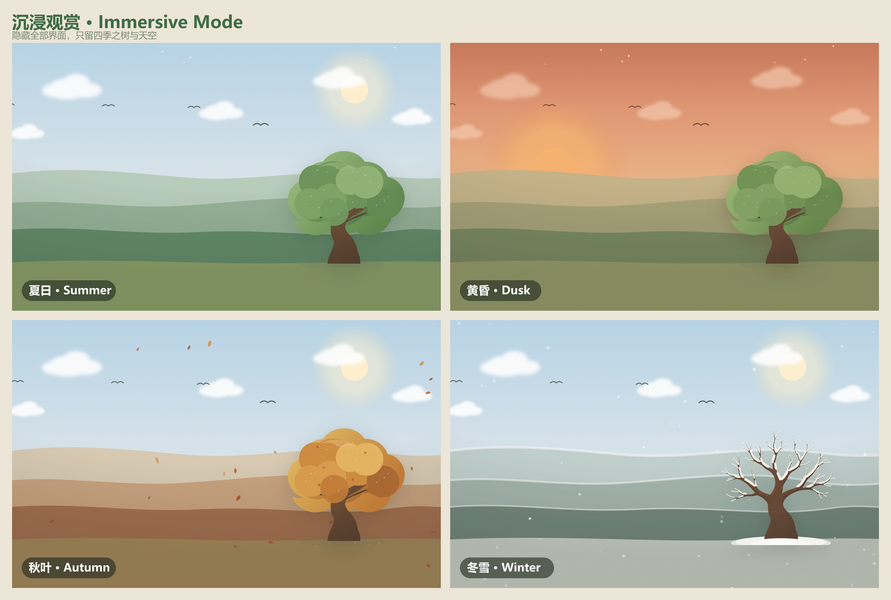

# Future

Future 是一个把目标、行动、专注、复盘与 AI 音乐陪伴连接成成长闭环的个人成长操作系统。

[在线体验](https://future-planner.claireeek.com) · [Demo 视频](#demo-video) · [产品介绍](#about-future)


<a id="demo-video"></a>

> **Demo 视频正在制作中。** 在两分钟产品演示发布前，请以[线上正式版本](https://future-planner.claireeek.com)为准。

## About Future

Future 不是另一个只记录任务的 Todo List。它把年度目标、月度主题、每周拆解和今日行动放在同一条路径里，再用番茄钟、习惯追踪、成功日记和随手笔记形成反馈，让“我想成为谁”能够持续落到“我今天做什么”。

我做 Future，是因为规划、执行、记录和情绪调节常常分散在不同工具里：计划写完后很少被重新看见，完成任务也很难沉淀为长期成长。Future 尝试把这些环节组织成一个温和、可持续的个人空间——四季成长树会随真实日期变化，界面会跟随一天的时间切换光线，Melo 则在需要专注或放松时提供有上下文的 AI 音乐陪伴。

产品支持中英文、桌面端与移动端，并已作为正式 Web 产品部署到 Cloudflare。联系邮箱：[claowennie@gmail.com](mailto:claowennie@gmail.com)。

## Core Features

| 模块 | 能做什么 |
| --- | --- |
| 分层规划 | 年度 OKR、月度主题、每周拆解、今日待办与重复任务形成同一条执行链路 |
| 专注与习惯 | 番茄钟、环境音、习惯打卡、连续天数和成长树共同提供即时反馈 |
| 记录与复盘 | 五件好事、每日 Reflection、成功日记和卡片式随手笔记沉淀过程 |
| Melo AI 电台 | 根据当下情境和音乐口味生成带串词的歌单，支持 YouTube、私有音频和网易云桌面桥 |
| 自适应体验 | 春夏秋冬、晨昼黄昏深夜、沉浸模式、响应式移动端与 PWA |
| 云端与隐私 | Supabase 登录与跨设备同步、RLS 数据隔离、导出备份、自助注销和临时 BYOK Key |







## Product Journey

| 阶段 | 产品演进 |
| --- | --- |
| 自用原型 | 从个人规划需求出发，完成 Today / Week / Month / Year、习惯、专注与复盘的核心闭环 |
| 云端化 | 从本机版 `future.v2` 拆出独立的 `future-deploy`，接入 Supabase Auth、Postgres RLS、私有存储和 Cloudflare Workers |
| Melo 成型 | 将原本依赖本机服务的电台重构为可部署的 AI 产品，加入 DeepSeek 结构化推荐、YouTube 歌单和私有音频 |
| 桌面音乐桥 | 设计 Future Companion，让网易云登录与播放留在用户电脑，本地服务只接受配对后的白名单指令 |
| 真实设备迭代 | 针对实际播放测试持续修复开场白与歌曲同步、自动换歌、播放器状态、音量曲线、登录过期与 TTS 错误反馈 |
| 正式发布 | 完成中英文界面、响应式设置、隐私与账号能力、安全头、限流、CI 检查和 Companion 官网直链下载 |

这段演进不是一次性生成页面，而是以“实现 → 真实账号/设备测试 → 复现问题 → 修复 → 回归验证”的方式推进。提交历史保留了从 Cloudflare 首次部署到 Melo 播放链路稳定、BYOK 语音和公开发布准备的完整迭代过程。

## What I Built

我负责 Future 从产品定义到公开上线的完整闭环，并把 AI Coding 作为工程协作方式，而不是替代产品判断：

- **产品设计**：定义信息架构、成长闭环、Melo 交互、双语体验和每轮迭代的验收标准。
- **AI Coding**：将目标拆成可验证的任务，驱动 AI agent 阅读现有代码、实现功能、补充测试，并对代码与最终体验负责。
- **真实调试**：使用自己的登录账号、网易云播放环境和语音 API 复现边界问题，持续修复播放时序、状态同步、音量、自动换歌、登录失效和云语音错误。
- **系统设计**：完成 Supabase 数据隔离、Cloudflare Worker API、浏览器临时 Key、网易云本机桥和多音乐来源之间的职责划分。
- **上线交付**：配置构建、测试、安全头、速率限制、运行时配置、GitHub 同步和 Cloudflare 部署，并在生产环境完成回归验收。
- **公开分发**：制作 Future Companion Windows 轻量包、中英文安装指南、校验值和网站内下载入口。

## Tech Stack

| 层级 | 技术 |
| --- | --- |
| Frontend | React 18、Vite 8、JavaScript、CSS、PWA、Web Speech API、YouTube IFrame API |
| Backend / Edge | Cloudflare Workers、Workers Static Assets、Wrangler、Rate Limiting |
| Data / Auth | Supabase Auth、Postgres、Row Level Security、Realtime、Private Storage |
| AI | DeepSeek BYOK、Google Chirp 3 HD、MiniMax Speech 2.8 HD、浏览器免费语音 |
| Local Companion | Node.js、`@music163/ncm-cli`、mpv、localhost pairing |
| Quality / Ops | ESLint、Node test runner、Vite production build、可选 Sentry、GitHub + Cloudflare Builds |

## Architecture

```text
Browser / PWA
  ├─ React product UI
  ├─ Supabase Auth + user JWT
  ├─ Supabase database / private audio storage (protected by RLS)
  ├─ YouTube official embedded player
  ├─ Browser speechSynthesis (default, free)
  ├─ Future Companion on 127.0.0.1 (optional NetEase playback)
  └─ Cloudflare Worker /api/*
       ├─ validates Supabase identity and same-origin requests
       ├─ reads user-scoped context through JWT + RLS
       ├─ validates structured AI output and allowlisted track IDs
       ├─ forwards DeepSeek requests with the user's temporary Key
       └─ forwards optional Google / MiniMax TTS requests
```

### Key technical decisions

- **BYOK 且短暂保存**：DeepSeek、Google TTS 和 MiniMax Key 只进入当前标签页的 `sessionStorage`，关闭标签页、退出登录或删除账号时清除，不写入 Supabase、Worker 配置、日志或构建产物。
- **用 RLS 做用户隔离**：Worker 不持有 Supabase `service_role`；数据库与私有音频访问均使用当前用户 JWT，由 Row Level Security 限定范围。
- **限制 AI 的执行能力**：模型只返回经过 Worker 校验的结构化动作和受限 `trackId`，不能生成任意存储路径、URL 或本机命令。
- **把本地凭证留在本地**：Future Companion 只监听 `127.0.0.1`，校验网页来源、配对码和动作白名单；网易云 Cookie、Private Key 与音频地址不会交给网站。
- **运行配置与前端同源**：生产环境通过 `/api/runtime-config.js` 注入 Supabase 公开配置；`/api/*` 与运行配置均禁止缓存。
- **失败可降级**：云语音失败会退回浏览器免费语音；没有 Companion 时，Supabase 私有曲库和 YouTube 仍可独立工作。

### Radio API

```text
GET  /api/radio/health
POST /api/radio/key/test
POST /api/radio/taste/analyze
POST /api/radio/chat
POST /api/radio/tts
```

所有 POST 请求都要求 Supabase 登录态和同源浏览器请求。DeepSeek 接口使用 `X-DeepSeek-Key`，可选云语音接口使用 `X-TTS-Key`；浏览器默认语音不调用 TTS API。Worker 对电台接口执行每账号/路由每分钟 20 次的速率限制。

### Future Companion

[下载 Future Companion Windows v0.6.1](https://future-planner.claireeek.com/downloads/future-companion-windows-v0.6.1.zip) · [查看本机桥设计](./docs/netease-companion.md)

公开 ZIP 包含 Companion 源码、首次安装向导、独立重新登录脚本和中英文 README，不包含 `.future-companion/config.json`、网易云 Cookie、App Private Key、API Key 或用户音频。

```text
Size:    16,206 bytes
SHA-256: 69175828E6A2514051228D15B6B1281C988E2E61C25E4F402604F701851359A5
```

## Local Development

### Requirements

- Node.js 22（仓库要求 `>=22 <25`）
- npm
- Supabase project
- Cloudflare account / Wrangler login（仅在调试或部署 Worker 时需要）

### 1. Install and configure

```powershell
git clone https://github.com/claowennie/future-deploy.git
cd future-deploy
npm install
```

在 Supabase SQL Editor 中按需执行：

1. [`supabase/radio.sql`](./supabase/radio.sql)：电台资料、曲目、消息、历史、RLS 与私有音频桶
2. [`supabase/radio-playlist-migration.sql`](./supabase/radio-playlist-migration.sql)：旧版电台表的歌单字段迁移
3. [`supabase/delete_user.sql`](./supabase/delete_user.sql)：账号自助删除
4. [`supabase/WEB_PUSH_SETUP.md`](./supabase/WEB_PUSH_SETUP.md)：可选 Web Push

复制前端公开配置：

```powershell
Copy-Item .env.example .env.local
```

```dotenv
VITE_SUPABASE_URL=https://YOUR-PROJECT-REF.supabase.co
VITE_SUPABASE_PUBLISHABLE_KEY=YOUR-SUPABASE-PUBLISHABLE-OR-ANON-KEY
VITE_VAPID_PUBLIC_KEY=
VITE_SENTRY_DSN=
```

复制 Worker 本地配置：

```powershell
Copy-Item .dev.vars.example .dev.vars
```

```dotenv
SUPABASE_URL=https://YOUR-PROJECT-REF.supabase.co
SUPABASE_PUBLISHABLE_KEY=YOUR-SUPABASE-PUBLISHABLE-OR-ANON-KEY
```

所有 `VITE_*` 都会进入浏览器产物，只能填写公开配置。不要在 `.env.local` 或 `.dev.vars` 中保存 DeepSeek / TTS Key、Supabase `service_role` 或 Cloudflare Token。

### 2. Run locally

使用两个终端：

```powershell
# Terminal 1 · Cloudflare Worker at http://localhost:8787
npm run dev:worker

# Terminal 2 · Vite at http://localhost:5173
npm run dev
```

Vite 会把 `/api` 转发给本地 Worker。打开 `http://localhost:5173`，登录后即可测试完整功能。

### 3. Verify before committing

```powershell
npm run check
```

该命令依次执行 ESLint、日期/合并/i18n/Melo/Companion 包测试、Worker 语法检查和生产构建。

## Deployment

正式站点运行在 Cloudflare Worker `future-planner`：

```text
https://future-planner.claireeek.com
```

### GitHub Builds

推荐将本仓库连接到 Cloudflare Workers & Pages：

```text
Production branch: main
Build command: npm run build
Deploy command: npm run deploy:cloudflare
Root directory: /
```

在 Build variables and secrets 中配置：

```text
SUPABASE_URL=https://YOUR-PROJECT-REF.supabase.co
SUPABASE_PUBLISHABLE_KEY=YOUR-SUPABASE-PUBLISHABLE-OR-ANON-KEY
```

[`scripts/deploy-cloudflare.mjs`](./scripts/deploy-cloudflare.mjs) 会在构建环境的临时目录中生成 Wrangler Secrets 文件，部署后立即删除；值不会进入 Git 仓库、网页 bundle 或构建日志。

### Manual deploy

```powershell
npm run check
npm run deploy
```

`wrangler.jsonc` 已配置 Static Assets、SPA fallback、`/api/*` Worker 优先、速率限制和 10% 可观测性采样。不要添加覆盖 `/api/*` 的全站缓存规则，并保留 `public/_headers` 中的 CSP 与安全响应头。

## Roadmap

- 优化首屏加载、弱网反馈与故障兜底，进一步减少偶发白屏和不可恢复的加载状态。
- 将 Future Companion 升级为签名安装程序，加入自动更新、依赖检测和可导出的诊断日志。
- 增加无需自行配置 API Key 的受限体验模式，降低第一次打开 Melo 的门槛。
- 为 Melo 增加更明确的推荐反馈、队列编辑和长期口味演进能力。
- 补充关键用户路径的端到端测试、可访问性检查和生产告警。
- 继续优化移动端、离线能力、Web Push 到达率与跨设备同步冲突体验。
- 整理两分钟产品演示与迭代 Case Study，清晰呈现核心流程、关键技术决策和真实调试过程。

## License

See [`LICENSE`](./LICENSE).
